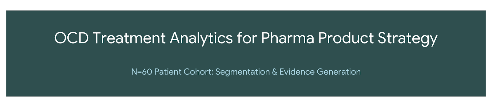
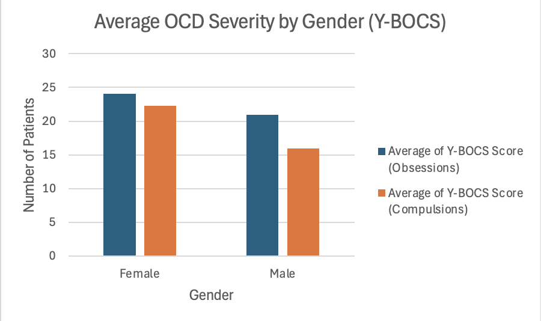
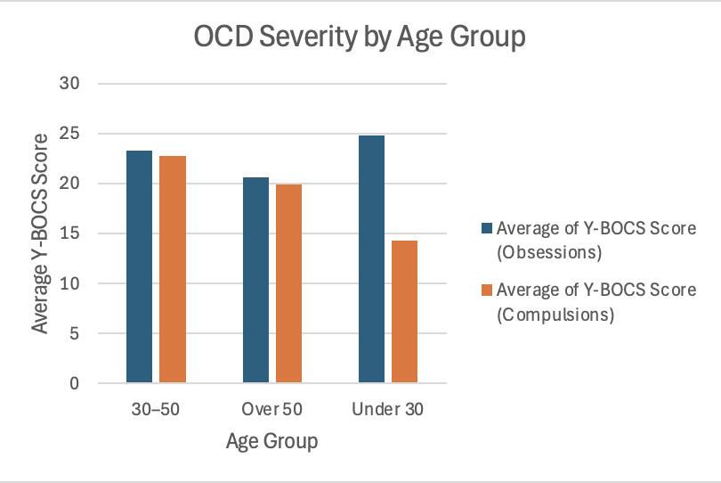
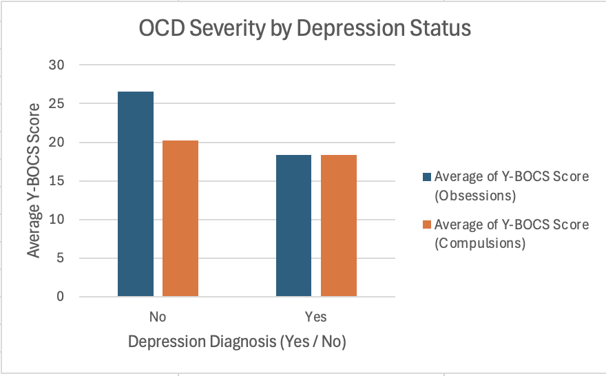
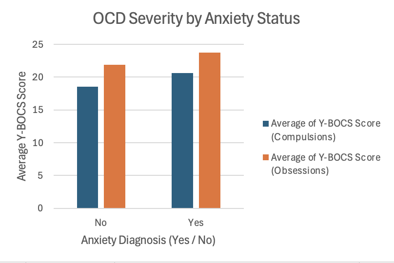
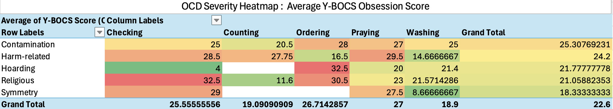
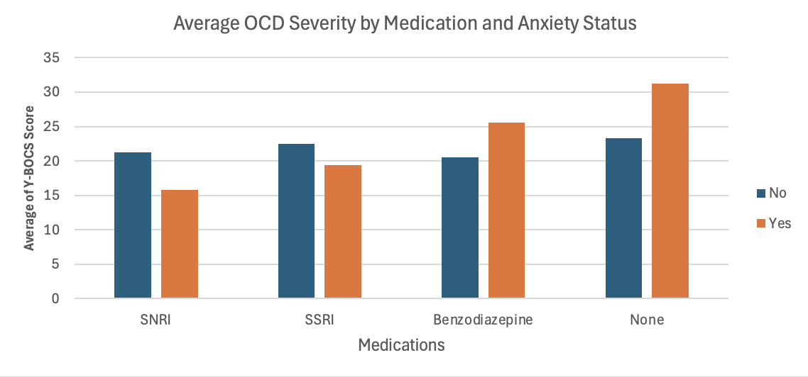

OCD Treatment Analytics for Pharma Product Strategy  
An Excel-based clinical analytics project exploring OCD severity patterns, comorbidities, demographics, and medication class performance to support product & medical strategy decisions.

# Table of Contents  
1. [Project Overview](#1-project-overview)  
2. [Dataset Summary](#2-dataset-summary)  
3. [Key Insights](#3-analytics--visual-insights)
4. [Strategic Recommendations](#4-strategic-insights-for-biopharma-product--medical-teams)
5. [Limitations & Next Steps](#limitations--next-steps)
6. [Repository Files](#5-repository-files)  

# 1. Project Overview  
This project demonstrates the capabilities of a **Health Data Analyst/Product Analyst** by translating real-world style clinical data (N = 60) into high-impact insights supporting:

- Therapeutic strategy  
- Market segmentation  
- Evidence generation  
- Clinical communication  
- Treatment optimization  

The analysis uses **Excel (PivotTables, calculated fields, dashboards)** to model:

## Core Analytical Objectives  
- **Severity Segmentation:** Identify patterns in Y-BOCS severity across demographics  
- **Comorbidity Impact:** Understand how Depression/Anxiety influence symptom burden  
- **High-Risk Phenotypes:** Detect severe Obsession–Compulsion clusters  
- **Treatment Performance:** Compare symptom severity across medication classes  
- **Prognostic Factors:** Analyze disease duration and long-term severity trends  

This reflects real analytical workflows used in Pharma, Medical Affairs, RWE, and Product Strategy.

# 2. Dataset Summary  

## **Core Attributes Collected**
- **Demographics:** Age, Gender  
- **Disease Profile:** Symptom duration  
- **Comorbidities:** Depression, Anxiety  
- **Clinical Variables:** Obsession type, Compulsion type  
- **Treatment:** Primary medication class  
- **Severity Metrics:** Y-BOCS Obsessions & Compulsions  

## **Derived Fields**
- **Total OCD Severity** = Mean of Obsession + Compulsion score  
- **Age Groups:** Under 30 · 30–50 · Over 50  
- **Duration Bands:** 0–5 yrs · 5–10 yrs · >10 yrs  

# 3. Analytics & Visual Insights  
This section transforms raw clinical data into meaningful insights for treatment optimization, product strategy, and evidence-based decision making.  
Each visualization includes **observations**, **clinical interpretation**, and **business implications**—mirroring real-world pharma analytics workflows.

## 3.1 Gender-driven severity differences highlight opportunities for tailored clinical interventions

### Observation  
Female patients show slightly higher average severity scores in both Obsessions and Compulsions.

### Interpretation  
This may indicate stronger emotional rumination patterns or heightened symptom awareness among females, aligning with known epidemiological trends in anxiety-spectrum disorders.

### Business Impact  
- Patient support materials may need gender-sensitive customization.  
- Medical Affairs could design female-focused awareness campaigns targeting early detection.  

---

## 3.2 Younger patients show early-stage, high-burden illness—an important signal for long-term treatment planning.

### Observation  
Patients **under 30** display the **highest severity**, followed by middle-aged adults (30–50).

### Interpretation  
Early pronounced symptoms suggest:
- Higher functional disruption early in life  
- Increased risk of chronicity without intervention  
- Greater sensitivity to stress triggers  

### Business Impact  
- Pharma can design **early-intervention programs** targeting younger adults.  
- Digital therapeutics and CBT companion apps may be particularly effective for this demographic.  

---

## 3.3 A surprising pattern: OCD may be more severe when it exists independently of depression.

### Observation  
Patients **without depression** show slightly **higher OCD severity** than those with depressive symptoms.

### Interpretation  
This suggests that:
- Their OCD symptoms may be **primary**, not secondary to mood disorders  
- Depression may overshadow OCD reporting, reducing apparent severity  
- Treatment plans may require different sequencing (e.g., OCD-first approach)  

### Business Impact  
- Medical Affairs messaging should highlight the differentiation between **primary OCD** vs. **OCD with mood overlap**.  
- Supports the need for **diagnostic clarity tools** in primary care settings.  
 

## 3.4 Anxiety amplifies compulsive behaviors—identifying a high-risk treatment-resistant phenotype

### Observation  
Patients with **Anxiety Comorbidity** exhibit **significantly higher Compulsion severity**.

### Interpretation  
This aligns with clinical understanding that anxiety:
- Increases ritualistic behavior  
- Intensifies fear-avoidance cycles  
- Makes compulsions harder to control  

### Business Impact  
- Reinforces need for combined therapy approaches (SSRI + CBT or DTx for anxiety-driven compulsions).  
- Useful segmentation criterion for real-world evidence studies.  

## 3.5 Identifying the highest-burden clinical phenotypes using persona driven severity mapping

### Observation  
Certain combination types emerge as **high-severity clusters**, including:
- **Religious Obsessions + Praying**  
- **Harm-related Obsessions + Checking**  
- **Symmetry Obsessions + Checking**  

### Interpretation  
These combinations often represent:
- High emotional distress  
- Time-consuming rituals  
- Increased risk of social and occupational impairment  

They are also among the subtypes most resistant to standard SSRI monotherapy.

### Business Impact  
- Ideal patient groups for precision-medicine trials 
- Strong candidates for advanced or adjunctive therapies  
- Actionable personas for Medical Affairs storytelling and HCP education  

## 3.6 Treatment gaps become visible when severity is compared across medication classes.

### Observation  
- Patients receiving **no medication** show the **highest overall severity**.  
- Benzodiazepine users also show elevated severity.  

### Interpretation  
This may reflect:
- Under-treatment or delayed treatment initiation  
- Improper reliance on benzodiazepines for acute relief rather than long-term management  
- Anxiety-driven patients requiring more structured therapy  

### Business Impact  
- Clear need for therapy initiation campaigns among untreated patients.  
- Highlights the importance of prescribing guidelines discouraging benzodiazepine monotherapy.  

## 3.7 Longer disease duration correlates with greater severity yet SSRIs show the most stable performance.

### Observation  
Severity increases steadily with **disease duration**, regardless of medication class.

### Interpretation  
Chronic OCD is harder to treat due to:
- Entrenched behavioral patterns  
- Poorer cognitive-behavioral flexibility  
- Increased comorbidity risk  

SSRIs appear to demonstrate **more stable severity curves**, showing reliable long-term effects.

### Business Impact  
- Reinforces SSRIs as the clinical first-line backbone.  
- Identifies long-duration patients as optimal targets for **augmentation trials**, new mechanisms, and digital support tools.  

# 4. Strategic Insights for Biopharma Product & Medical Teams  

## 4.1 High-Value Unmet-Need Segments  
- **Untreated, high-severity patients**  
- **Long-duration, partial-response patients**  
- **Early severe onset (<30 yrs)** — ideal for early-intervention campaigns  

## 4.2 Medication Class Performance  
- **SSRIs:** Most stable long-term control  
- **SNRIs:** Highly variable → requires targeted RWE  
- **Benzodiazepines:** Associated with high severity → treatment-resistant signal  

## 4.3 Behavioral Phenotype Clusters  
Heatmap-driven phenotypes support:
- Precision segmentation  
- RWE prioritization  
- Advanced therapy messaging  

## 4.4 Opportunities for Intervention  
- Digital therapeutics for high compulsion severity  
- Combined therapy strategies for comorbidity-linked severity  
- Early intervention for high-burden young adults  

# 5. Limitations & Next Steps  

## Limitations  
- Sample size = 60  
- Medication adherence not measured  
- Limited comorbidity categories  

## Next Steps  
- Build regression models to predict severity  
- Expand dataset to 500+ patients  
- Develop automated Excel dashboards  

# 6. Repository Files  

| File | Description |
|------|-------------|
| `ocd_analytics.xlsx` | Primary patient dataset |
| `dataset/*.png` | Visualizations exported from Excel |
| `README.md` | Full project report |

**Project by Zeel Bhatt**  
**zeelbhatt2003@gmail.com**

