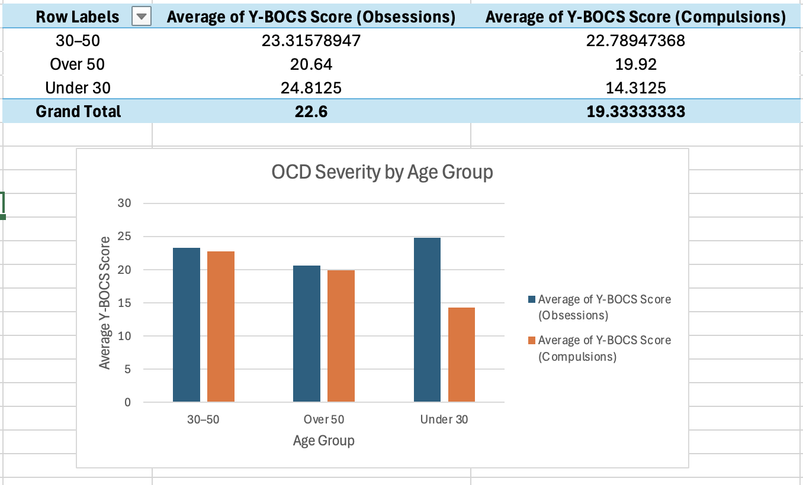

# OCD Treatment Analytics for Pharma Product Strategy  
An Excel-based clinical analytics project exploring OCD severity patterns, comorbidities, demographics, and medication class performance to support product & medical strategy decisions.

---

## 1. Project Overview  
This project analyzes real-world-style OCD patient data (N=60) to uncover:

- Patterns in symptom severity across demographic groups  
- The impact of depression and anxiety comorbidities  
- High-risk obsession–compulsion combinations  
- Treatment differences across medication classes  
- How disease duration influences severity and treatment outcomes  

The goal is to demonstrate how a **Product Analyst or Medical Affairs Analyst** interprets clinical data to support evidence-based strategy, segmentation, and decision-making.

All analysis was performed in **Excel** using PivotTables, calculated fields, and visual dashboards.

---

## 2. Dataset Summary  
Each patient record includes:

- Age, gender, ethnicity  
- OCD diagnosis date + duration of symptoms  
- Obsession type & compulsion type  
- Depression / anxiety comorbidities  
- Medication class (SSRI, SNRI, Benzodiazepine, None)  
- Severity scores (Y-BOCS Obsessions & Compulsions)

Derived fields:  
- **Total OCD Severity** = Average of obsession + compulsion score  
- **Age group** (Under 30, 30–50, Over 50)  
- **Duration band** (0–5 yrs, 5–10 yrs, >10 yrs)

---

## 3. Analytics & Visual Insights  

Each visualization is paired with a clear interpretation written from a pharma-analytics perspective.

---

### 🔹 3.1 OCD Severity by Gender  
**Insight:**  
Female patients show slightly higher severity scores in both obsessions and compulsions.  
This suggests gender-specific symptom expression, which may influence patient support programs or targeted educational material.

**Visualization:**  

---

### 🔹 3.2 OCD Severity by Age Group  
**Insight:**  
Patients under 30 demonstrate the highest average severity.  
This indicates earlier-stage, more disruptive illness, representing a key segment for early-intervention therapies and long-term treatment planning.

**Visualization:**  

---

### 🔹 3.3 OCD Severity by Depression Comorbidity  
**Insight:**  
Patients without depression show *higher* OCD scores.  
This suggests their OCD symptoms may be more primary rather than secondary to mood disorders — potentially affecting how treatment is prioritized.

**Visualization:**  

---

### 🔹 3.4 OCD Severity by Anxiety Comorbidity  
**Insight:**  
Anxiety comorbidity correlates with significantly higher compulsion severity.  
This implies anxiety may intensify compulsive behaviors — a valuable insight for combination-therapy research or clinical messaging.

**Visualization:**  

---

### 🔹 3.5 Obsession–Compulsion Severity Heatmap  
**Insight:**  
This heatmap identifies high-severity pairings such as:  
- **Religious + Praying**  
- **Harm-related + Checking**  
- **Symmetry + Checking**  

These clusters highlight the most clinically burdensome behavior patterns and help identify patients needing intensified therapy.

**Visualization:**  

---

### 🔹 3.6 Medication Class × Anxiety Status  
**Insight:**  
Among medication classes, patients on **“None”** showed the highest severity — indicating unmet treatment needs.  
For medicated patients, benzodiazepine users showed relatively high severity, suggesting partial response or inappropriate monotherapy.

**Visualization:**  

---

### 🔹 3.7 Medication Class × Disease Duration  
**Insight:**  
Severity tends to increase with longer disease duration for all medication classes.  
SSRI users show the most stable pattern across duration groups, supporting SSRIs as the most consistent long-term therapy.

**Visualization:**  

---

## 4. Strategic Insights for Pharma / Product Teams  

### ⭐ **1. Clear unmet-need segments**
- High-severity, untreated patients  
- Long-duration patients with partial response  
- Younger patients with severe onset  

### ⭐ **2. Medication class performance**
- SSRIs show the most consistent symptom control  
- SNRI performance varies by comorbidity  
- Benzodiazepine use correlates with higher severity → possible misuse or treatment-resistant subgroup  

### ⭐ **3. Behavioral phenotype clusters**
Heatmap identifies severe OCD phenotypes → useful for precision medicine segmentation.

### ⭐ **4. Opportunities for targeted interventions**
- Digital therapeutics for high-severity compulsions  
- Early-intervention programs for young adults  
- Messaging for clinicians around comorbidity-linked severity  

---

## 5. Files in This Repository 
